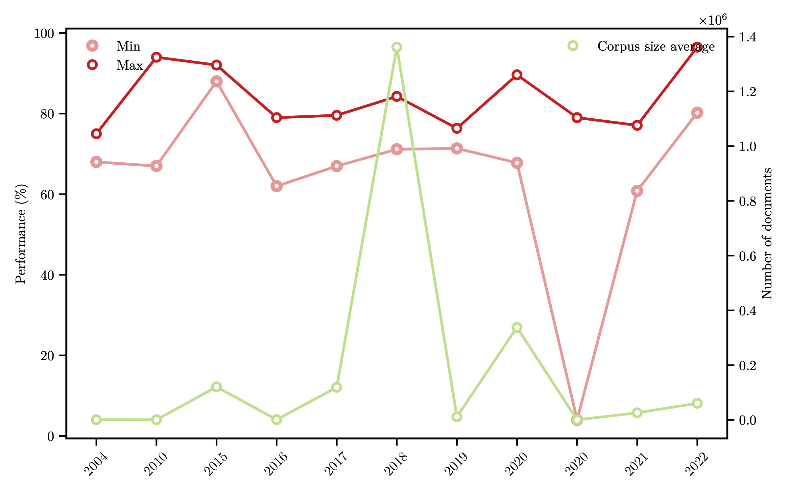
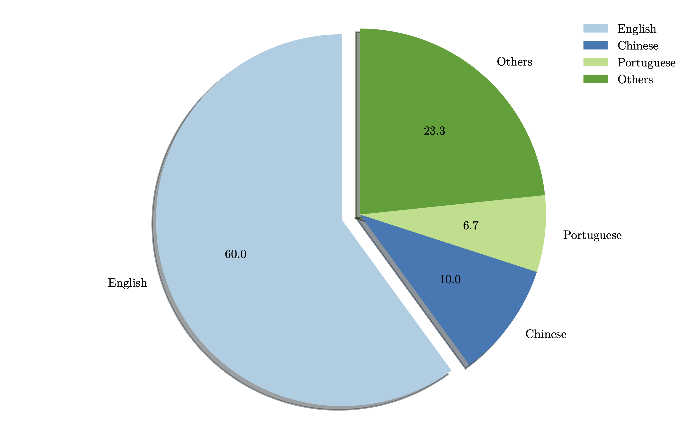
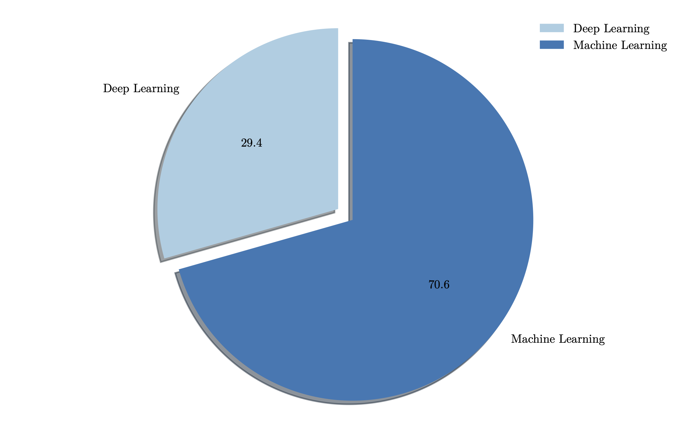
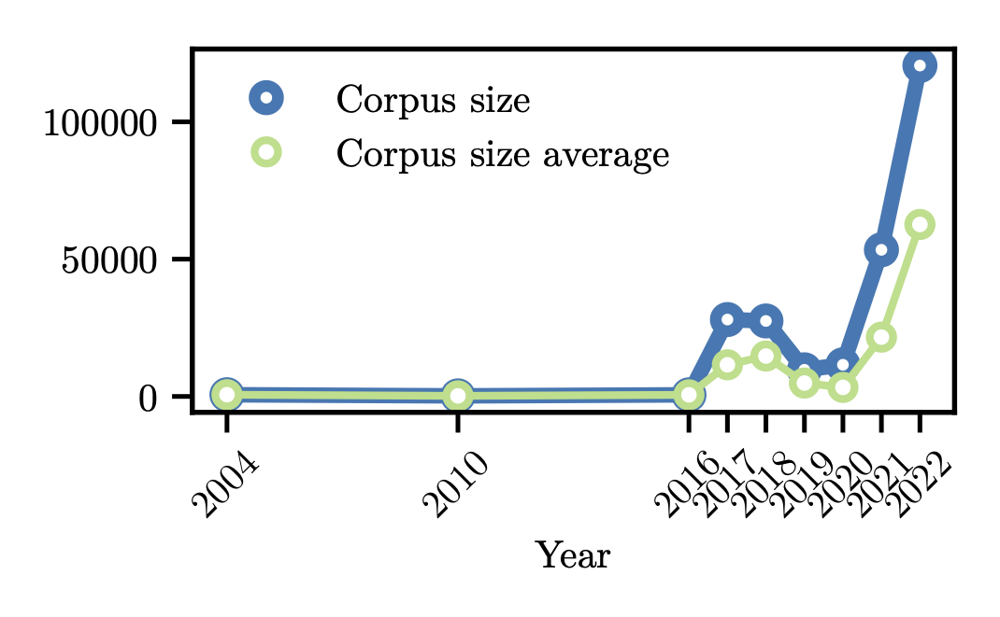

## Readme

This files are for reproducing the results of the paper intitled : *"Survey of Text Mining Techniques Applied to Judicial Decisions Prediction"*.

The CSV files are the input for the analysis :

1. table_judgebot.csv
2. models_has.csv

The folder **MFig** is the library for making the figures.

The file *analisis.ipynb* is the notebook, which perform the analysis about:

### Perfoprmance 

 
 
### Languages 

 
 
### Models

### Corpus size

